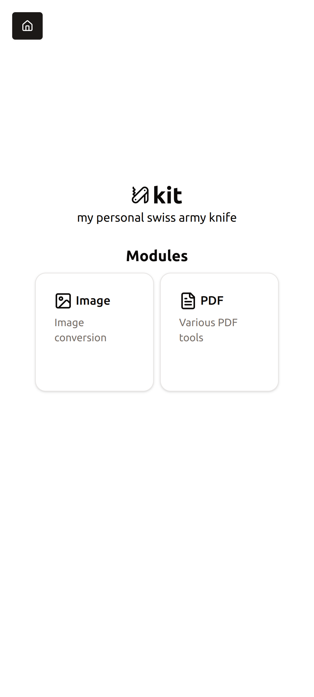
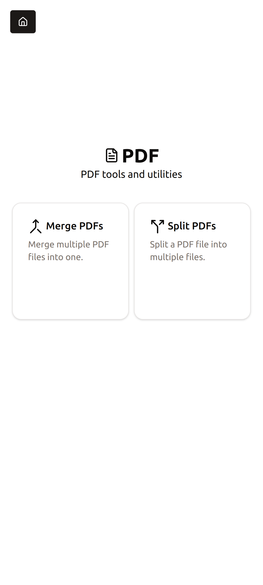
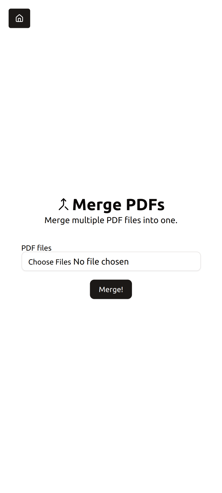

# kit

My personal swiss army knife. A collection of tools I commonly use on the web.

## Goals

- Replace the need for multiple different SaaS tools with a single, centralized and self-hosted solution.
  ( e.g. PDF tools like iLovePDF, Adobe; image tools and so on )
- Provide a simple, easy and straightforward interface to interact with.

## Screenshots

    
    
    

